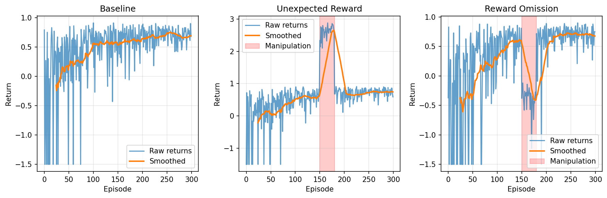
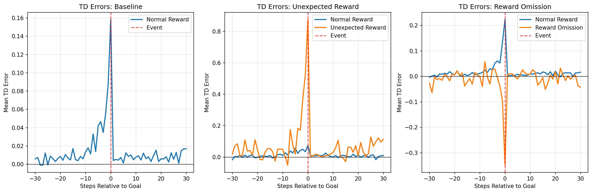
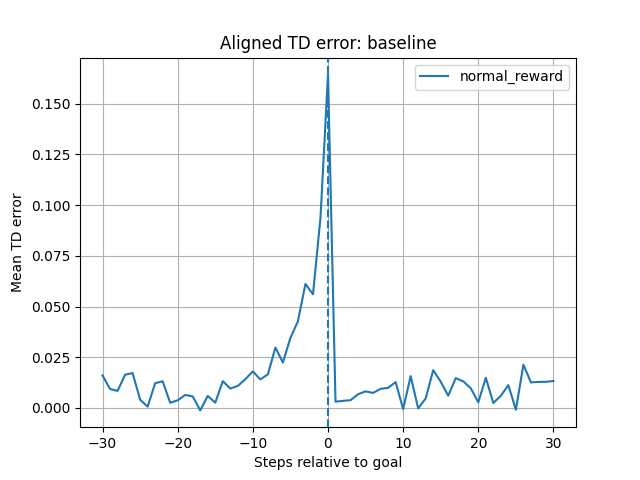
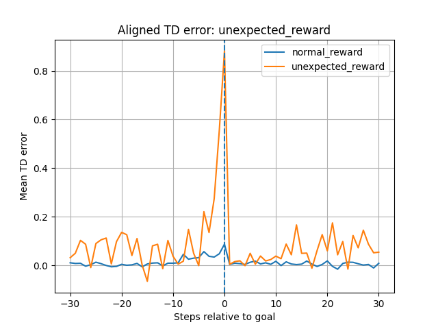
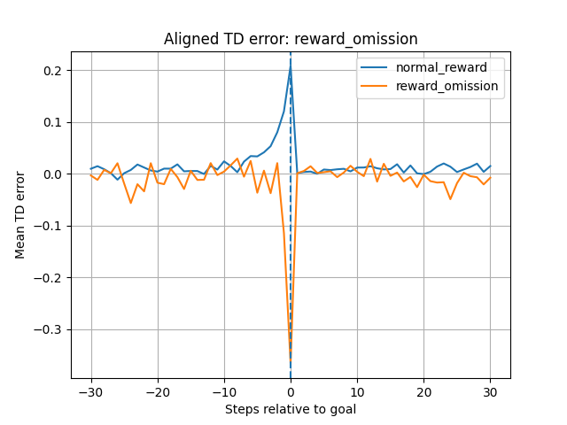

## RL Dopamine Demo — Reward Prediction Errors (RPE)

This small project demonstrates how temporal-difference (TD) error can act like a dopamine reward prediction error (RPE).
Experiments: baseline, unexpected_reward (extra mid-training bonus), reward_omission (mid-training omission).

Files produced: returns_*.png, aligned_tds_*.png, learned_policy_unexpected.txt

Interpretation: unexpected reward produces positive RPE peaks; omission produces negative dips.

## 📊 Results

### Returns
Learning performance across conditions (baseline, unexpected reward, omission):

### TD Errors (dopamine-like signals)
Average TD error aligned to reward events:

- **Positive burst** when unexpected reward appears  
- **Negative dip** when expected reward is omitted  
- **Baseline** resembles stabilized dopamine response  

---

### Individual Experiment Traces

#### Baseline

#### Unexpected Reward

#### Reward Omission

---
